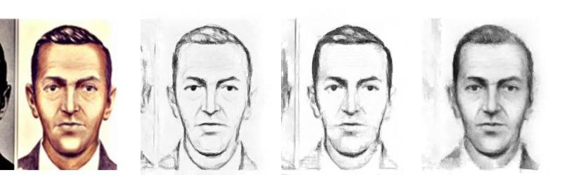
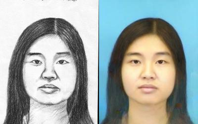
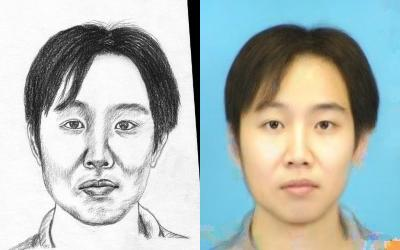
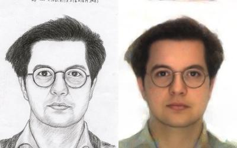
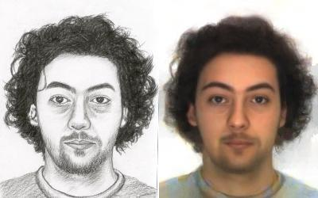
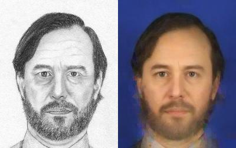
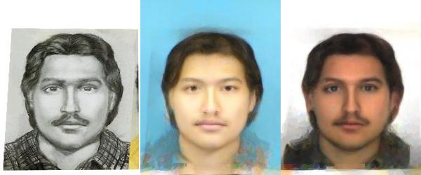

# MvDT
This repository contains more results for the paper:

>**Universal Face Photo-Sketch Style Transfer via Multiview Domain Translation**
>
>Chunlei Peng, Nannan Wang, Jie Li, Xinbo Gao
>
>Xidian University

This paper is the first to address universal face photo-sketch style transfer problem which is able to translate input photo (or sketch) into the style of an entire sketch (or photo) collection when source domain
training photos (or sketches) are not available.

## Results

We provide more experimental results in the folders:

- [`Photo-to-Sketch Translation on CUFS:`](Results/Photo-to-Sketch-CUFS/README.md)

&emsp;&emsp;&emsp;&emsp;&emsp;&emsp;&emsp;&emsp;&emsp;&emsp;&emsp;&emsp;&emsp;&emsp;&emsp;&emsp;&emsp;&emsp;&emsp;&emsp;&emsp; 

- [`Photo-to-Sketch Translation on Universal Styles:`](Results/Photo-to-Sketch-Universal/README.md)

&emsp;&emsp;&emsp;&emsp;&emsp;&emsp;&emsp;&emsp;&emsp;&emsp;&emsp;&emsp; 

- [`Sketch-to-Photo Translation on CUFS:`](Results/Sketch-to-Photo-CUFS/README.md)

&emsp;&emsp;&emsp;&emsp;&emsp;&emsp;&emsp;&emsp;&emsp;&emsp;&emsp;&emsp;&emsp;&emsp;&emsp;&emsp;&emsp;&emsp;&emsp;&emsp;&emsp; 

- [`Sketch-to-Photo Translation on Universal Styles:`](Results/Sketch-to-Photo-Universal/README.md)

&emsp;&emsp;&emsp;&emsp;&emsp;&emsp;&emsp;&emsp;&emsp;&emsp;&emsp;&emsp;&emsp;&emsp;&emsp;&emsp;&emsp;&emsp;&emsp;&emsp; 

**The results can also be downloaded from [Google Drive](https://drive.google.com/open?id=1gChfqjFrdysLVDtyzRjm3RCOGhMNXLgS), or from [Baidu Drive](https://pan.baidu.com/s/13_NaT3a-UOOrb7SFv0W_XQ)** with password `t2jn`.

## Databases

- [CUFS Database](http://mmlab.ie.cuhk.edu.hk/archive/facesketch.html)
- [Forensic Database](http://dx.doi.org/10.1109/TPAMI.2016.2542816)
- [Caricature-photograph database](http://www.gag.itu.edu.tr/CPdatabase/)
- [IIIT-CFW dataset](https://cvit.iiit.ac.in/research/projects/cvit-projects/cartoonfaces)

## Contact

If you have any questions or suggestions about the paper, feel free to reach me (clp.xidian@gmail.com).

